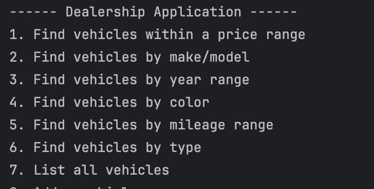
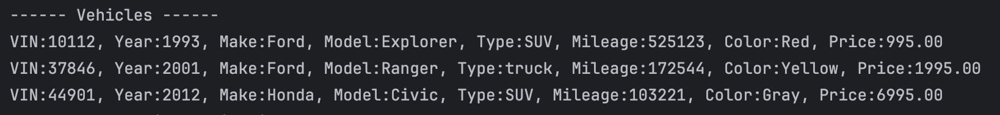
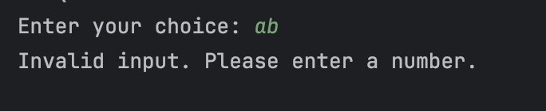
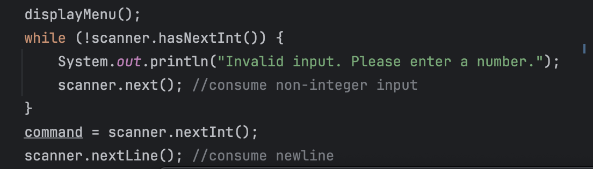

# Object-Oriented Car Dealership
___
This project is a simple Java application for managing a dealership's inventory of vehicles. It allows users to perform various operations such as searching for vehicles, adding new vehicles, and removing existing vehicles from the inventory.
___
## Features
Search by Price Range: Users can search for vehicles within a given price range.

Search by Make and Model: Users can search for vehicles based on their make and model.

Search by Year Range: Users can search for vehicles within a given year range.

Search by Color: Users can search for vehicles based on their color.

Search by Mileage: Users can search for vehicles with mileage below a certain threshold.

Search by Vehicle Type: Users can search for vehicles based on their type (e.g., sedan, SUV, truck).

List All Vehicles: Users can view a list of all vehicles in the inventory.

Add New Vehicle: Users can add a new vehicle to the inventory.

Remove Vehicle: Users can remove an existing vehicle from the inventory.
___
## Home Screen

## Products Display Screen

## Error Screen

___
## Interesting code

The loop is run when the input from the user is not an integer so the program will continue to run with erroneous inputs.